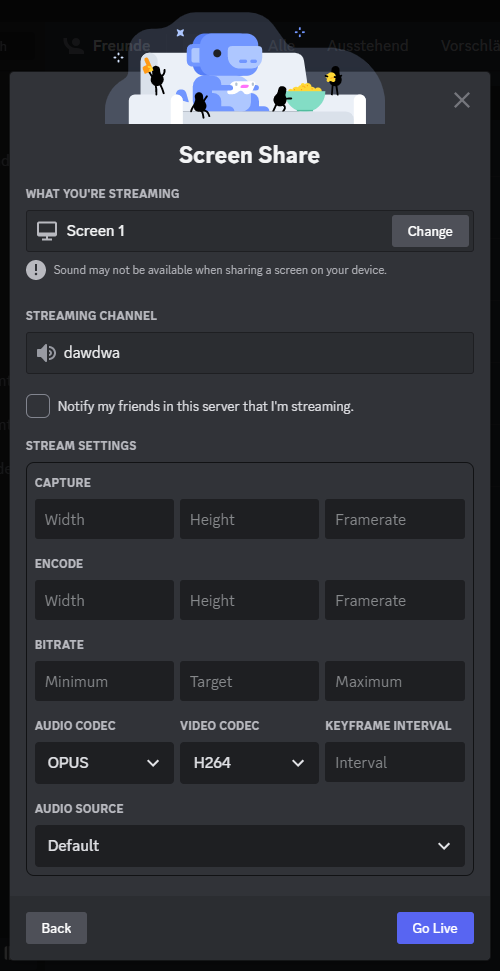

# Better Discord Screenshare Plugin

With this plugin you can customize your resolution, framerate, bitrate and more for your screenshare on discord! This plugin requires an [installation](https://github.com/BetterDiscord/BetterDiscord#manual-installation 'installation') of the [BetterDiscord](https://github.com/BetterDiscord/BetterDiscord 'BetterDiscord') client.

<div align='center'>
  
</div>

## Plugin

To get the plugin you can create it yourself by cloning this repository or download it directly from the dist folder in this repository

## Features

- **Capture** - Set a custom capture resolution and framerate.
- **Encode** - Set a custom encode resolution and framerate.
- **Bitrate** - Set a custom min, target and max bitrate.
- **Keyframe Interval** - Set a custom keyframe interval.
- **Audio Source** - Set a custom audio source even when sharing a screen.
- **Codec** - Set a custom video and audio codec [OPUS, H264, VP8, VP9, AV1].

## Default Config

```
{
  bitrate: {
    minimum: 1000,
    target: 2500,
    maximum: 5000,
  },
  encode: {
    framerate: 60,
    height: 1080,
    width: 1920,
  },
  capture: {
    framerate: 60,
    height: 1080,
    width: 1920,
  },
  audioCodec: 'OPUS',
  videoCodec: 'H264',
}
```

## Known Issues

When sharing a window directly it can sometimes happen that no changes are applied, the reason for this is unknown at this time, but to avoid this you can simply share your screen and set the audio source if needed.

## Scripts

- `build` Build the plugin.
- `watch` Build the plugin when a change was made.

## Credits

- [Zerthox](https://github.com/Zerthox) for BetterDiscord's API [typings](https://github.com/Zerthox/betterdiscord-types), [Dium](https://github.com/Zerthox/BetterDiscord-Plugins/tree/master/packages/dium) and his huge amount of help.
